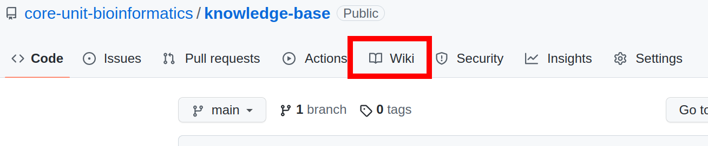

# Knowledge base of the Core Unit Bioinformatics

This is the right place to share helpful information with your peers, your clients and the outside world.

The content in this repository is organized in form of a [GitHub Wiki](https://docs.github.com/en/communities/documenting-your-project-with-wikis/about-wikis). All articles should focus on a single topic, and present information in a structured and concise way.

Please proceed to the Wiki by clicking the respective button above:

